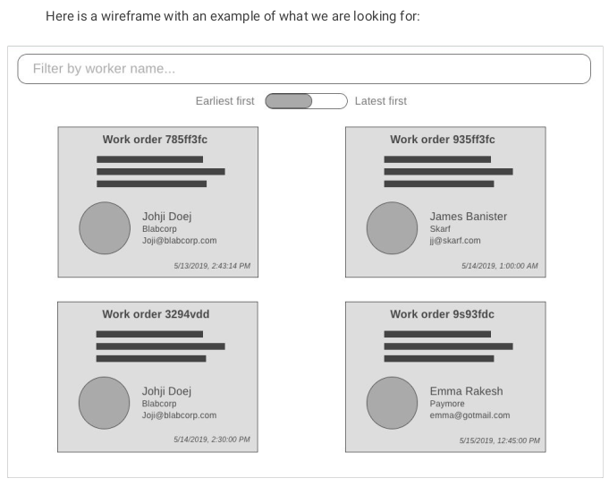

<h1 align="center">React project to search into work orders 👋 </h1>
<p>
  
  <a href="#" target="_blank">
    
  </a>
</p>

### Description

<div align="center">




</div>

## Install

```sh
npm i
```

## Usage

```sh
npm start
```

## Run tests

```sh
npm run test
```
